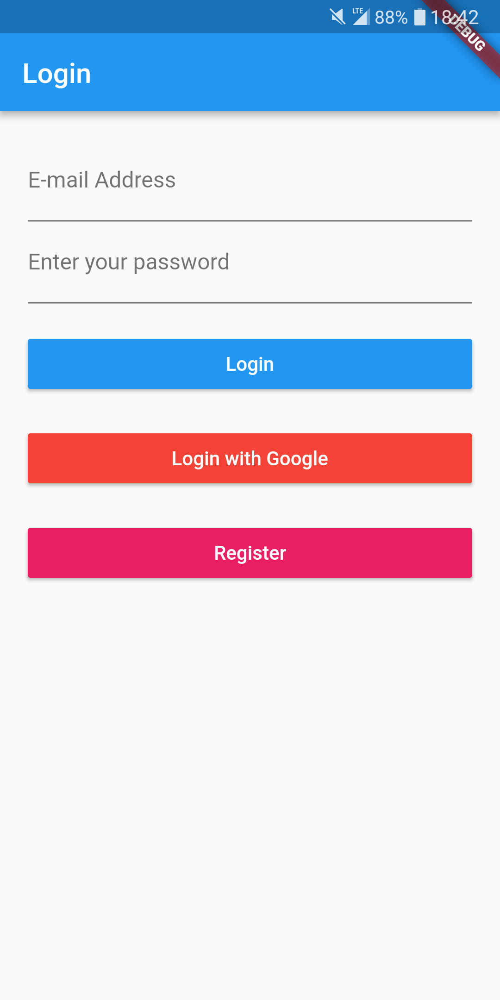
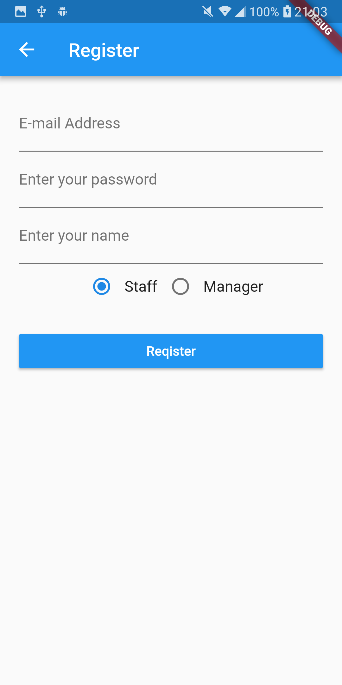
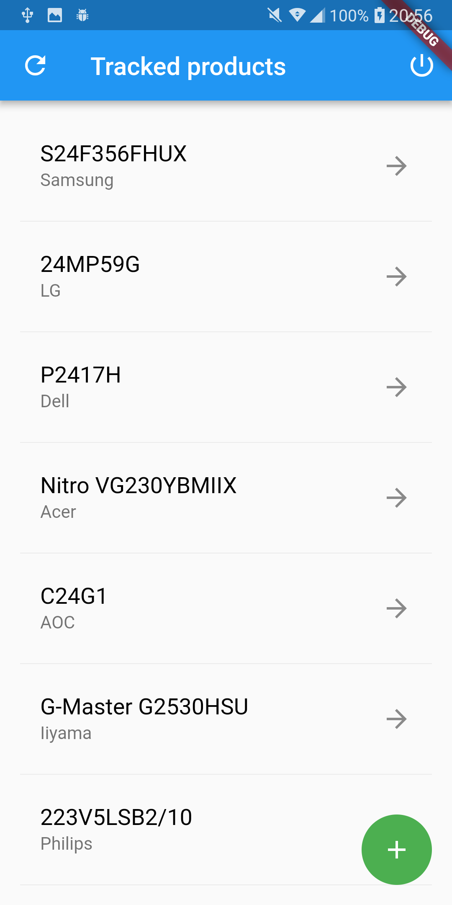
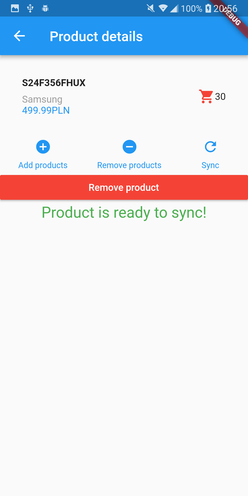
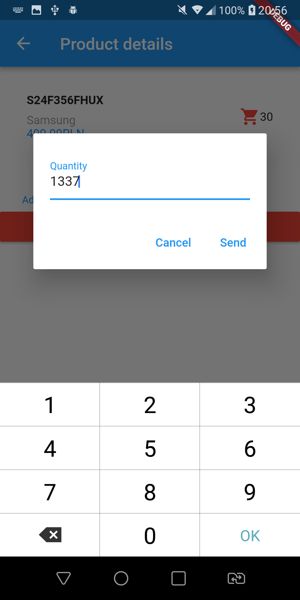
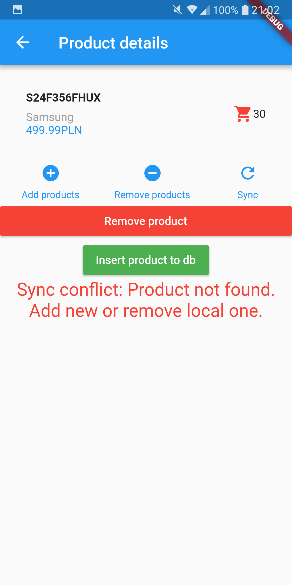

# Warehouse_mobile

## Screenshots

## Project requirements

The task is to create a simple warehouse management system comprised of a mobile app and a back-end server-side application. The purpose of the system is to keep track of products that are delivered to the warehouse and departed to customers. The system should provide information about the amount of each product available in stock. The mobile app is meant to be used by warehouse employees and managers.

Each product is described by a set of fields:

- manufacturer name (e.g. Samsung),
- model name (e.g. Galaxy S9),
- price (e.g. 3.499 PLN),
- quantity - the number of items we have in stock.  

The application should offer following operations:

- add new product - new products should be added with amount=0,
- increase quantity of a product by x - invoked when new supply is delivered to the warehouse,
- decrease quantity of a product by x - invoked when products are departed from warehouse to customers,
- remove a product - invoked when the warehouse manager is no longer interested in monitoring the given product (should be available only to managers).
- Important note: users should not be able to directly modify the current quantity of a product available in stock. Instead of that users provide information about the change in quantity (the number of items delivered to warehouse of sent from the warehouse). The current quantity in stock should be at all times calculated by the system.

The list of products should be stored on the server. It is not required at this stage of the project to store the data on the mobile device (this ability will be added in stage II). All operations on products should immediately call appropriate server API methods, to update the state on the server.

__Access control__  
The application should handle multiple users. It should distinguish two user roles:

- warehouse manager - with access to all operations,
- warehouse employee - with access to all operations except removing products.

Access control should be based on OAuth 2.0 and OpenID Connect protocols (both will be discussed in details during lectures). The application should be able to obtain users identity from two sources:
- a 3rd party identity provider like Google, Facebook or LinkedIn (e.g. "Login with Facebook" functionality),
- a 1st party identity provider integrated with server-side application (for users who do not want to share their identity from an external provider).

__Synchronization__  ([Implemented sync strategy](doc/sync.md))

The mobile app should be enhanced with an ability to store data about tracked products in the local memory of a mobile device. All operations on products (adding new products, increasing amount, decreasing amount and removing) should now be available regardless of the availability of a network connection.

Single user can run the mobile app on multiple devices (e.g. on a smartphone and on a tablet). Each device can store app data in its local memory and can be used offline to modify the local data. Because of that it is necessary to design a data synchronization algorithm that can handle concurrent modification of data on multiple devices.

The information stored on the server side should resemble the actual quantity of products in stock regardless of the order of modifications of data on different mobile devices and regardless of the order in which those devices were synchronized with the server.

Mobile devices may experience prolonged periods of network connection unavailability. During the time frame between local data modification and successful synchronization with the server the same data may be modified on another device or by a different user. Synchronization algorithm should handle possible data conflicts without misrepresenting the data.

During the presentation of this stage at least two instances of the app should be showcased (e.g. using two instances of an emulator). For the ease of presentation synchronization should be triggered by a button or a menu item in the mobile app.
